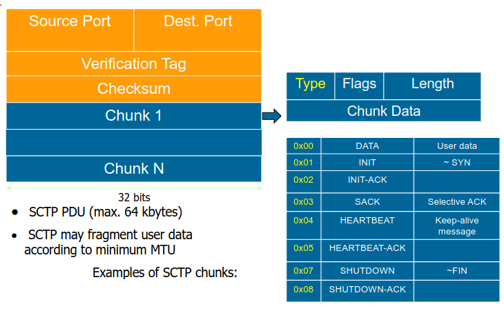
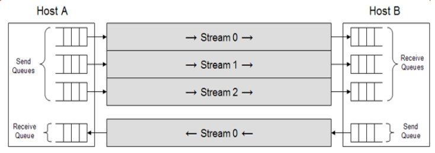
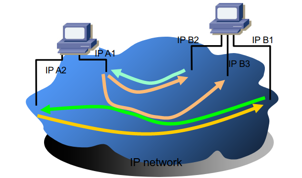
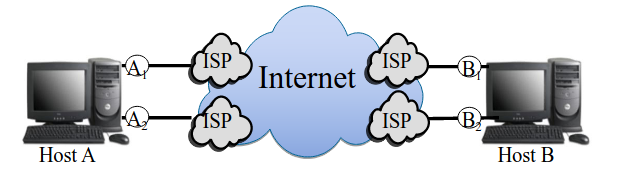
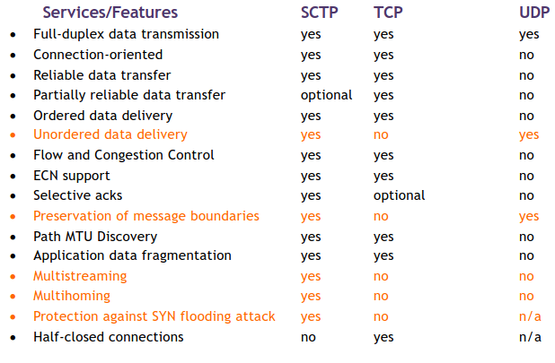
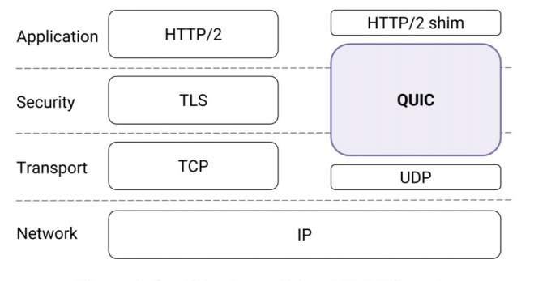

# Protocolos de Transporte - Desenvolvimentos Recentes

## *Stream Control Transmission Protocol* (SCTP)

### Motivação

- Fiabilidade, mas sem ordenação;
- Fiabilidade, mas não é orientado à *stream*;
- Mais escalabilidade e redundância (*multihoming*);
- Mais robusto (contra ataques).

Basicamente, quando comparado ao TCP, tem como objetivo melhorar o desempenho e robustez do transporte.

### Introdução

- Tal como o TCP, providencia transferências fiáveis, em *full-duplex* e *unicast*;
- Ao contrário do TCP e do UDP, oferece novas opções de entrega que são particularmente desejáveis para sinalização de telefonia e aplicações multimédia.

### Objetivos

- Mantém as retransmissões fiáveis do TCP, congestão de controlo e orientadas à conexão, mais:
  - *framing* - preserva as barreiras das mensagens;
  - *4-way handshake* - para reduzir a vulnerabilidade a ataques DoS;
  - *multistreaming* - até 64 mil *streams* independentes ordenadas;
  - *multihoming* - ao invés de um endereço IP por *endpoint*, utiliza um conjunto de endereços IP por *endpoint*.
    - O SCTP utiliza o *multihoming* para redundância e não para balanceamento de carga.

### Associação

- A combinação entre uma porta SCTP e um endereço IP define o "*SCTP Transport Address*";
- Um *endpoint* SCTP:
  - é o fim lógica de um protocolo de transporte SCTP - uma *party* de comunicação;
  - Pode ter mais do que um endereço IP, mas terá sempre uma única porta;
    - `endpoint = [10.1.4.2, 10.1.5.3:80]`.
  - Em SCTP, a relação de comunicação entre dois *endpoints* é denominada associação.
    - `association = {[10.1.61.11:2223], [10.1.4.2, 10.1.5.3:80]}`.

### *Framing*

- Mantém os limites de uma mensagem, uma mensagem aplicacional é mantida como um mais *chunks* de dados;
- O objetivo é melhorar o desempenho removendo o *blocking* nos dados recebidos, quer seja devido ao *delay* ou devido à perda.
- Separação da entrega fiável e ordenada;
  - Permitir a entrega não ordenada elimina o *delay head-of-line*;
- As aplicações podem querer unidades de dados lógicas (*chunks*);
- Ver os dados como uma *byte stream* é ineficiente;
- Preserva o *Application Level Framing*;
  - Cada envio/leitura é um *chunk* (isto é, uma unidade de dados da aplicação).

### *Packets*

- Cabeçalho comum com três funções básicas:
  - Portas de fonte e destino, usadas em conjunto com os endereços IP e outra informação de estado para identificar a associação (conexão);
  - Etiqueta de verificação aleatória e negociada no `init`;
  - *Checksum*: CRC32 no *packet* SCTP total.
- Seguida por um o mais *chunks*;
  - *Chunks* são blocos de construção concatenados contendo dados de controlo ou de informação;
  - O cabeçalho de um *chunk* identifica o seu tamanho, ou seu tipo e qualquer *flag* especial;
  - *Chunks* de controlo transferem informação necessária para a funcionalidade de associação e *chunks* de dados carregam a camada de dados da aplicação;
  - O RFC atual especifica 14 *chunks* de controlo diferentes para o estabelecimento de associação, terminação, ACK, recuperação de falhas no destino, ECN e *reporting* de erros.

### *4-way handshake*

### *Multistreaming* SCTP

- O TCP providencia transporte para uma *stream* de dados singular;
- O SCTP permite múltiplas *streams* independentes por associação.

- Separação lógica dos dados numa assoicação;
- Desenhada para prevenir o *head-of-line blocking*;
- Pode ser usada para entregar múltiplos objetos dentro da mesma associação.

### *Multihoming* SCTP

- É capaz de gerir múltiplos cenários com múltiplos endereços IP de fonte e destino (interfaces com e sem cabo, múltiplos ISPs, etc...)

- Os *hosts* escolhem 1 das 4 possíveis conexões TCP:
  - `{(A1, B1), (A1, B2), (A2, B1), (A2, B2)}`;
- *Hosts* usam 1 associação sctp:
  - `({A1, A2}, {B1, B2})`;
  - Destino primário selecionável;
  - Envia novos dados para o destino primário;
  - Monitoriza o estado do caminho e o seu alcance (*heartbeats*).

- Conexão TCP $\Leftrightarrow$ Associação SCTP
  - 2 endereços IP, 2 números de portas $\Leftrightarrow$ 2 conjuntos de endereços IP, 2 números de portas;
  - Um *flow* comum e um mecanismos de congestão de controlo é mantido de forma a reduzir o *overhead*;
- **Objetivo**: robustez
  - Automaticamente, troca os endereços IP dos *hosts* até falhar;
  - Elimite o efeito de longos períodos de tempo para a reconvergência do *routing*.
- **TCP**: não garante que a mensagens permaneçam "vivas" quando a conexão está *idle*;
- **SCTP**: monitoriza o alcance de cada destino através de `ACKs` de:
  - *Chunks* de dados;
  - *Chunks* de *heartbeat*;

### Comparado a Outros Protocolos

## QUIC

### Motivação

- Necessidade de providenciar uma entrega rápida e *rendering* ao nível da aplicação;
- Pretende resolver resolver os problemas do TCP tendo uma motivação semelhante ao SCTP, permitindo:
  - Remoção do *HOL blocking*;
  - Multiplexando diferentes *streams*;
  - Aumentando a segurança.

### Princípios

- Providencia aplicação com *streams* de *flow* controlado para comunicação estruturada, com um estabelecimento de conexão com baixa latência e migração do caminho rede;
- Inclui medidas de segurança que garantem a confidencialidade, a integridade e a disponibilidade baseada no TLS;
- Corre em cima do TLS/UDP, implementando o controlo de congestão;
- É um protocolo orietando à conexão que cria uma interação com estado entre o cliente e o servidor.

### Operação

- O *handshaking* combina a negociação entre parâmetros de transporte e criptográficos (com baixas preocupações RTT);
- Os *endpoints* comunicam trocando *packets* QUIC;
- Os *packets* contêm *frames* que carregam informação de controlo e dados da aplicação entre *endpoints*;
- Protocolos da aplicação enviam dados através de uma conexão QUIC via *streams* que são sequências ordenadas de *bytes*;
- As *streams* podem ser bi-direcionais ou uni-direcionais (apenas um *endpoint* pode enviar dados);
- O controlo de *flow* baseia-se num esquema baseado em créditos para limitar a crianção de *streams* e limitar a quantidade de dados que podem ser enviados;
- Providencia o *feedback* necessário para implementar uma entrega fiável e congestão de controlo;
- Migração de caminhos, as conexões não estão estritamente presas a um único caminho na rede. O cliente pode migrar para um novo caminho, se disponível (precisa de *probing* e de *path validation*).