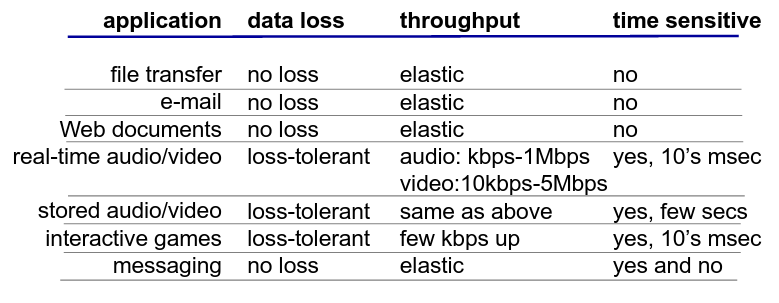
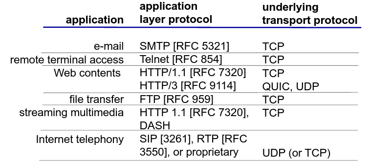
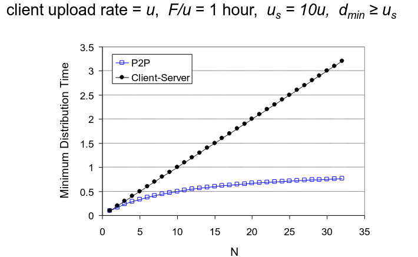

# Teórica 02

## Camada Aplicacional

- Apesar da rede da *Internet* ter sido criada para a simples troca de documentos, hoje em dia, as aplicações presentes na *Internet* são de todos os tipos, podendo gerar uma quantidade de tráfego muito distinta entre elas.
- No entanto, a criação de uma *app* deve ser feita com a preocupação "exclusiva" que esta seja capaz de correr nos *end systems*, ignorando por completo os passos intermédios da *app* na rede.

### *End-to-End Principle*

Quem desenvolve aplicações não tem de se preocupar com a rede e quem trata da rede não tem de se preocupar com as *apps*.

#### NOTA:

Hoje em dia, este processo não é bem estrito...

No fundo, tem de existir um pouco de preocupação mútua em ambos os lados da moeda...

Por exemplo, as operadoras de rede analisam o tráfego dos seus clientes, enquanto que os *devs* têm de ter conhecimento acerca dos protocolos de transporte disponíveis na rede.

### Arquitetura de Aplicações

Em rede, as aplicações podem possuir diferentes arquiteturas. Por exemplo:

1. *Client-Server*;
2. *Peer-to-Peer* (P2P).

#### Arquitetura *Client-Server*

**Servidor:**

- Sempre *online*;
- Endereço de IP permanente;
- Utiliza *data centers* para permitir a escalabilidade.

**Clientes:**

- Comunicam com o servidor;
- Podem conectar e desconectar-se à vontade;
- Podem ter endereços de IP dinâmicos;
- Não comunicam diretamente entre si.

#### Arquitetura P2P

- Não têm um servidor sempre *online*;
- Os *end-systems* comunicam diretamente entre si;
- Um *peer* fornece/consome serviços a/de outros *peers*;
- **Auto-escalável**: novos *peers* fornecem novos serviços e trazem novos pedidos;
- Um *peer* é, simultaneamente, cliente e servidor.
  - Tem processos tanto de cliente, como de servidor.
- *Peers* podem (des)conectar-se à vontade e trocam de endereços IP.
  - Isto causa uma gestão complexa.

### Comunicação de Processos

Um processo é um programa que se encontra a correr num dado *host*. Processos em *hosts* diferentes comunicam através da troca de mensagens.

**Processo do Cliente**: processo que inicia a comunicação.

**Processo do Servidor**: processo que espera até ser contactado.

#### *Sockets*

Os processos enviam e recebem mensagens através dos seus *sockets* que são análogos a uma porta.

#### Endereçamento de Processos

- De forma a receber mensagens, um processo deverá conter um ID.
  - O ID inclui tanto o endereço IP como o número da porta associada ao processo no *host*.

$$IPv4/IPv6 + Porta$$

- Porta do `HTTP Server`: 80;
- Porta do `Mail Server`: 25.

### Protocolo da Camada Aplicacional

Define:

- Tipo das mensagens trocadas;
- *Syntax* das mensagens;
- Semântica das mensagens;
- Regras relativas ao quando e como os processos devem receber/responder às mensagens.

### Como decidir qual o serviço de transporte a utilizar?

Depende dos requisitos da aplicação em questão, devendo ter os seguintes **fatores em conta**:

- Integridade dos dados;
  - A *app* é capaz de tolerar faltas?
- *Timing*;
  - Podemos ter *delay*?
- Largura de Banda;
  - Há um valor mínimo necessário?
- Segurança;
  - Precisa-se de assegurar encriptação, integridade, etc...?

De notar que apesar da maioria dos sistemas terem mais do que uma interface ativa, o `TCP` só tira partido de 1, pelo que *apps* mais recentes tendem a seguir outros protocolos de comunicação.

### Segurança em TCP

De forma a providenciar segurança em TCP., deve-se correr o TLS (*Transport Layer Security*) que irá encriptar as conexões, providenciar integridade de dados e fornecer um sistema com autenticação *end-to-end*.

## Tempo de Distribuição de Ficheiros

Pretendemos comparar as diferentes arquiteturas, tendo por base o tempo necessário para distribuir um ficheiro $F$ por $N$ clientes.

Devemos efetuar o estudo com base nos piores casos disponíveis:

### *Client-Server*

- **Transmissão do Servidor**: deverá enviar de forma sequencial $N$ cópias do ficheiro.
  - Tempo para enviar 1 cópia: $\frac{1}{u_{s}}$;
  - Tempo para enviar $N$ cópias: $\frac{NF}{u_{s}}$.
- **Cliente**: Cada cliente deve fazer *download* de uma cópia do ficheiro.
  - $d_{min}$: menor taxa de *download* dos clientes;
  - Tempo: $\frac{F}{d_{min}}$

$$D_{c-s} \geq max\{\frac{NF}{u_s}, \frac{F}{d_{min}}\}$$

Ou seja, aumenta linearmente em $N$.

### *Peer-to-Peer* (P2P)

- **Transmissão do Servidor**: deverá dar *upload* de, pelo menos, uma cópia.
  - Tempo para enviar uma cópia: $\frac{F}{u_s}$
 **Cliente**: Cada cliente deve fazer *download* de uma cópia do ficheiro.
  - $d_{min}$: menor taxa de *download* dos clientes;
  - Tempo: $\frac{F}{d_{min}}$
- **Clientes**: Como um agregado devem fazer o *download* de $NF$ *bits*.
  - O *upload rate* máximo é de $u_s + \sum{u_i}$

$$D_{P2P} \geq {\frac{F}{u_s}, \frac{F}{d_{min}},\frac{NF}{u_s+\sum{u_i}}}$$

Ou seja, apesar de $NF$ aumentar linearmente em $N$, o somatŕoio também o fará, visto que cada *peer* tratá a sua capacidade de servidor.

