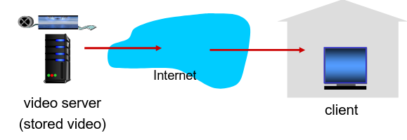
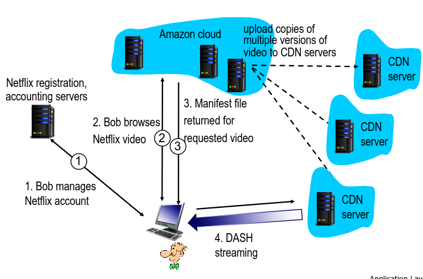

# Distribuição de Ficheiros em P2P e Streaming

| **Característica**                   | **Client-Server**                                     | **P2P**                                                |
|--------------------------------------|-------------------------------------------------------|--------------------------------------------------------|
| **Foco**                             | Troca de Dados                                        | Conetividade, Comunicação                              |
| **Transmissão de dados**             | Servidor providencia todos  os serviços               | Peers são server e cliente                             |
| **Custo**                            | Mais caro para manter                                 | Mais barato                                            |
| **Gestão**                           | Mais simples                                          | Mais complexa                                          |
| **Performance**                      | Mais robusta, pode ser expandida                      | Performance pode diminuir para um grande número de nós |
| **Distribuição de Largura de Banda** | Depende, sobretudo, da conexão do servidor à Internet | Não é pré-alocada. Depende dos recursos de cada par    |
| **Segurança**                        | Servidor único, mais seguro                           | Segurança depende de cada peer em si                   |

## Distribuição de Ficheiros em P2P: BitTorrent

- Ficheiro dividido em pedaços (*chunks*) de 256*kbs*;
- Os *peers* no *torrent* enviam e recebem pedaçõs do ficheiro.
  - Cada um ds peers mantém uma lista do seu top 4 de outros *peers* para receber novos *chunks*.
    - Esta lista é atualizada a cada 10 segundos.
- Dá-se o nome de *tracker* ao servidor de indexação.
- *Peer* a juntar-se ao *torrent*:
  - Não tem *chunks*, mas irá acumulá-los ao logo do tempo com os outros *peers*;
- Enquanto faz o *download*, o *peer* irá dar *upload* de *chunks* para outros *peers*.
- O *peer* poderá provocar alterações num outro *peer* com quem efetue trocas;
- ***churn***: medida de desempenho $\rightarrow$ quantidade de utilizadores que abandonam o produto sem ter o ficheiro completo;
- Quando um *peer* já tem o ficheiro completo poderá sair da rede ou manter-se no *torrent*.

### Pedir e Enviar *chunks*

#### Pedir

- Num dado intervalo de tempo, diferentes *peers* têm diferentes conjuntos de *chunks*;
- Periódicamente, o cliente irá pedir aos *peers* a lista com os *chunks* que este contém.
- O cliente irá pedir *chunks* em falta so clientes, geralmente, não o primeiro.

#### Envio de *chunks*: *tit-for-tat*

- Cliente que pediu os *chunks* irá enviar *chunks* aos 4 *peers* que lhe estão a enviar com uma maior taxa;
  - Os restantes estão a ser *choked* por esse cliente (não recebem *chunks* desse cliente).
- A cada 30 segundos esse cliente irá escolher de forma aleatória outro *peer* e começará a enviar-lhe  *chunks*.
  - A este processo diz-se que o cliente está a fazer *optimistically unchoke* do *peer*;
  - Este *peer* poderá juntar-se ao top 4 do cliente.

## *Streaming* de Vídeo e CDNs

Grande parte do tráfego da rede é, hoje em dia, devido a vídeo. Assim, surgem diversos desafios:

**Escala**: Como é que podemos alcançar cerca de 2B de clientes?

- Um único servidor gigante não iria funcionar.

**Heterogeniedade**: 

- Utilizadores diferentes podem ter capacidades diferentes (cabelada *vs mobile*, boa largura de banda *vs* baixa largura de banda).

Para estes problemas existe a solução de tornar estas aplicações distribuídas e colocá-las ao nível da infraestutura da camada *web*.

### Multimédia: Vídeo

- Imagem digitais: *array* de píxeis;
  - Cada píxel é representado por *bits*.
- Deve utilizar-se redundância com e entre imagens para diminuir o número de *bits* utilizados para codificar a imagem.
  - **Espacial** (na imagem);
  - **Temporal** (entre imagens).
- **CBR** (*constant bit rate*):
  - *Encoding rate* do vídeo fixo;
- **VBR** (*variable bit rate*):
  - *Encoding rate* do vídeo altera de acordo com a redundância espacial e temporal.

### *Streaming* de um vídeo armazenado

**Principais Desafios**:

- Largura de banda entre o cliente e o servidor irá variar consoante os níveis de congestão na rede;
- Perda de pacotes, *delay* devido à congestão irá provocar um *delay* no vídeo ou uma má qaulidade de vídeo.

### *Streaming* de multimédia: DASH

- **DASH**: *Dynamic, Adaptive Streaming over HTTP*
- **Servidor**:
  - Divide o ficheiro do vídeo em múltiplos *chunks*;
  - Cada *chunk* é armazenado e codificado com *rates* diferentes;
  - Ficheiro de *MANIFEST*: providencia URLs para *chunks* diferentes.
- **Cliente**:
  - Periódicamente mede a largura de banda entre o servidor e o cliente;
  - Consulta o *MANIFEST* e pede um *chunk* de cada vez.
    - Escolhe o máximo de *coding rate* sustentável na largura de banda atual;
    - Pode escolher diferentes *coding rates* em diferentes períodos de tempo (depende da largura de banda naquele momento),
- Coloca a "inteligência" no cliente, visto que este determina:
  - **quando** pedir *chunks* (de forma a evitar *starvation* ou *overflow*);
  - **qual o *encoding rate*** a pedir (melhor qualidade quando tem maior largura de banda disponível);
  - **onde** pedir o *chunk* (pode pedir ao servidor URL que se encontra mais perto do cliente ou tem uma grande largura de banda disponível).

### *Content Distribution Networks* (CDNs)

- **Desafio**: Como efetuar a *stream* de conteúdo (selecionado de milhões de vídeos) para centenas de milhares de utilizadores em simultâneo=
  - **Opção 1**: Mega Servidor largo e singular.
    - Ponto único de falha;
    - Ponto de congestão de rede;
    - Grande distância até aos clientes;
    - Múltiplas cópias do vídeo enviadas através do *link* de saída;
    - Basicamente, esta solução **não é escalável**.
  - **Opção 2**: Armazena/Serve múltiplas cópias de vídeos em múltiplos sítios distribuídos geograficamente.
    - *enter deep*: coloca os servidores CDN em múltiplas redes de acesso.
      - próxima dos utilizadores (tentativa de *single hop*);
      - utilizada pelo *Akamai*.
    - *bring home*: menor número de grandes *clusters* em POPs próximos das redes de acesso.
      - utilizada pelo *Limelight*.
- Guarda cópias do conteúdo em nodos CDN;
- Utilizador pede o conteúdo ao CDN.
  - Direcionado para a cópia mais próxima, recebe o conteúdo dessa fonte;
  - Pode escolher diferentes cópias se a rede estiver congestionada.
- **Desafios**: lidar com a rede congestionada.
  - A qual nodo CDN se deve ir buscar o conteúdo?
  - Qual o comportamento do *viewer* em casos de congestão?
  - O que colocar em cada nodo CDN? A que *rate*?

#### Caso de Estudo: Netflix

