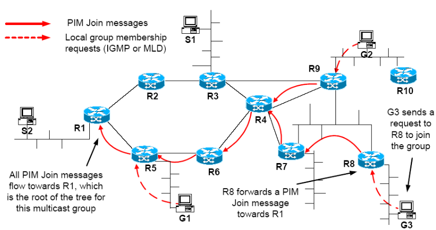
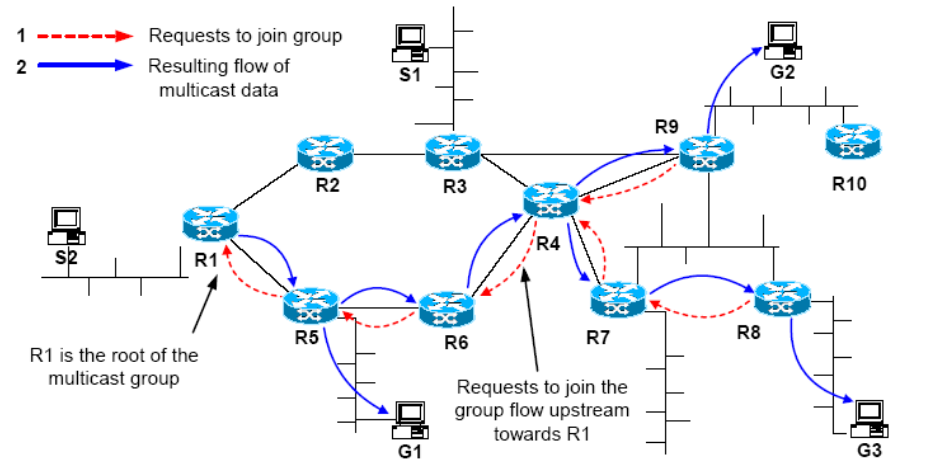
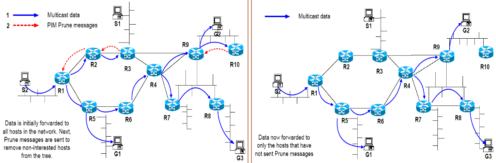
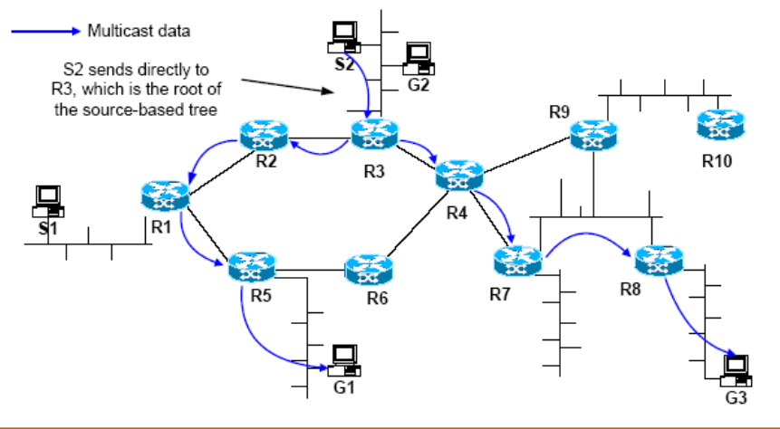
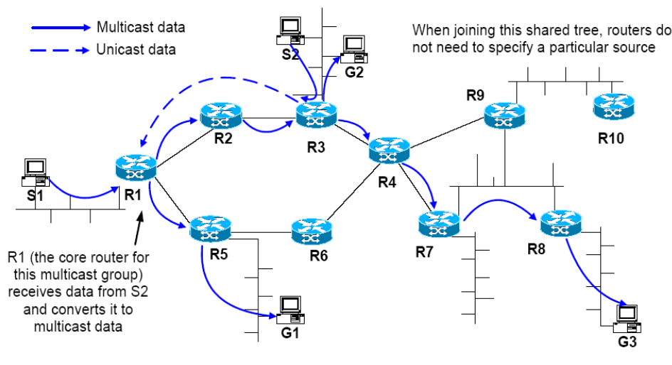
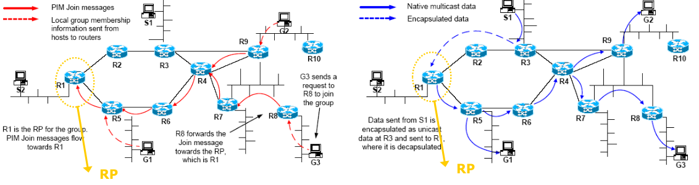
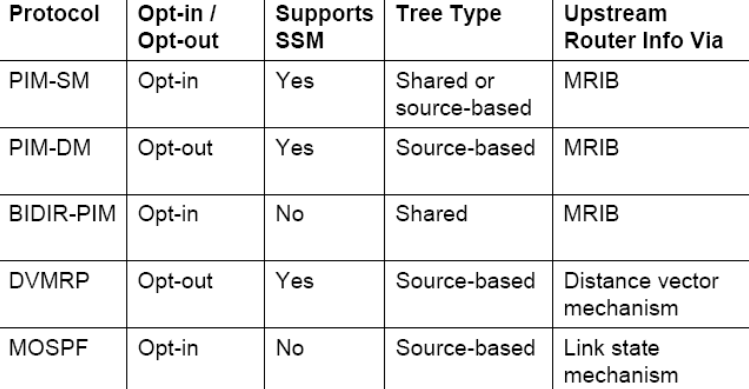

# Multicast II

## *Multicast*

### Alternativas de *Design*

- *Hosts* que se pretendam juntar a um grupo podem:
  - Receber dados enviados para o grupo de alguma fonte (especifica apenas o grupo de *multicast*) - *Any Source Multicast* (ASM);
  - Apenas receber dados de uma fonte específica ($grupo\ de\ multicast + origem$) - *Source-Specific Multicast*.
- **Protocolos de *Routing* de *Multicast***
  1. Um *router* conhece os membros dos grupos dos seus *hosts* conectados diretamente;
  2. Troca informação com os restantes *routers*;
  3. Junta-se ou separa-se das árvores de um grupo de *multicast*.
- **Como construir uma árvore de distribuição de um grupo de *multicast* para múltiplos recetores?**
  - *opt-in protocols*: Árvores são construídas a partir dos recetores. Não assume que existam clientes interessados à partida;
  - *opt-out protocols*: O servidor toma a iniciativa de enviar para a rede sem querer saber se existem clientes interessados.
    - Inunda a rede (*routers* guardam estado);
    - Corta os ramos que não lhe interessam.
- **Tipos de Árvores:**
  - *source-based trees*: Existe 1 árvore de entrega independente por fonte;
  - *shared tree*: Todas as fontes enviam para a mesma árvore.

### Protocolos de *Routing*

1. PIM-SM (*Product Independent Multicast Sparse Mode*);
2. PIM-DM (*Product Independent Multicast Dense Mode*);
3. DVMRP (*Distance Vector Multicast Routing Protocol*);
4. MOSPF (*Multicast OSPF*);
5. ...

**NOTA:**

- Ambientes densos permitem que se consuma uma maior quantidade de recursos (maior disponibilidade e clientes mais próximos);
- Ambientes dispersos não permitem grandes consumos de recursos.

### *Opt-In*

- Árvore é construída a partir do ponto que se pretende ligar ao grupo.
  - Anuncia o interesse pela rota até ao *router* de acesso;
    - Em redes *overlay*, este processo pode ser bastante difícil.
  - *Routers* vão guardando estado de forma a saberem a rota, sem terem de a descobrir a cada iteração.
- Podem utilizar-se *souce-based trees* ou *shared-trees*.

**Início do Processo**

**Resultado**

### *Opt-Out*

- Utiliza **apenas** *source-based trees*;
- Inicialmente, os dados são enviados para todos os *hosts* da rede;
  - Efetua um *flood* controlado.
- Envia *prune messages* para remover da árvore de *multicast*.

### *Source-based Trees*

- Constrói uma árvore separada para cada fonte que envie dados;
  - A árvore será aquela que terá os melhores caminhos do cliente para o servidor;
  - No entanto, não existem garantias que será a melhor do servidor para o cliente.
- Cada árvore tem raíz num *router* adjacente ao emissor;
- Os *routers* que se pretendam juntar ao grupo de *multicast* devem especificar a ***source*** e o **grupo** de dados *multicast* que pretendem recebem. Para isso, envia uma mensagem indicadora dessa informação ao próximo *upstream router*;
- **Vantagens**:
  - Caminhos para os dados *multicast* são muito eficientes.
- **Desvantagens**:
  - Problemas de escalabilidade para um grande número de fontes.
- SSM (*Source Specified Multicast*) requer a utilização de *source-based trees*.

#### Exemplo

- A árvore tem raíz em $R3$.
  - $S2$ envia dados diretamente à raíz da árvore;
- Nova fonte em $S1$
  - Implica que seja contruída uma nova árvore a partir de $R1$.

### *Shared Trees Protocols*

- Uma árvore singular é utilizada por todas as fontes do grupo de *multicast*;
- Um *router* que se pretenda juntar ao grupo de *multicast* mão precisa de especificar a fonte do grupo ao qual se pretende juntar. Envia uma mensagem em que especifica apenas o grupo ao próximo *upstream router*.
- **Vantagens**:
  - Necessários menos recursos;
  - Melhor para um grande número de fontes.
    - Fontes enviam dados em *unicast* até ao ponto central e lá é feita a distribuição.
- **Desvantagens**:
  - Caminhos de dados ineficientes;
  - Precisa de um mecanismo de seleção da raíz da árvore (RP);
  - Ponto único de falha.

#### Exemplo

### Determinação do *Upstream Router*

- Os protocolos de *routing* precisam de determinar qual será a próxima interface de *upstram* para o grupo de *multicast* - Algoritmo RPF (*Reverse Path Forwarding*);
- *Router* utiliza a interface de *upstream*;
  - Como interface de saída para pacotes de controlo (p.e. *join*, *leave*, *prune messages*, ...);
  - Como interfaces de entrada para dados *multicast*.
    - Se os pacotes vêm de uma interface distinta, então descarta-os/ignora-os de forma a evitar pacotes duplicados e *loops*.
- PIM confia em MRIBs (*Multicast Routing Information Database*) de forma a efetuar RPF *lookups*.
  - MRIBs são semelhantes a tabelas de encaminhamento *unicast*.

### PIM (*Protocol Independent Multicast*)

- 2 principais protocolos:
  - ***PIM Sparse Mode* (PIM-SM)** é um protocolo *opt-in* que utiliza, maioritariamente, *shared* e *source-based trees*;
    - Utilizado largamente em ambientes com recursos escassos.
  - ***PIM Dense Mode* (PIM-DM)** é um protocolo *opt-out* (*broadcast*/*prune*) que **apenas** utiliza *source-based trees*.
    - Utilizado maioritariamente em pequenos domínios;
    - Consome poucos recursos à rede.

#### *PIM Sparse Mode*

- Por *default* utiliza *shared-trees* com raízes no *router*;
- Também oferece suporte às *source-based trees* para:
  - Evitar encapsulamento;
  - Otimizar caminhos para os dados;
  - Para *source-specific multicast* (SSM).
- É um protocolo *soft-state*:
  - O estado dá *timeout* algum tempo após receber mensagens de controlo;
  - Mensagens de *join* são re-transmitidas periódicamente de forma a manter o estado.

**Método**:

1. *Hosts* indicam o seu interesse em juntar-se ao grupo através de IGMP ou MLD;
2. Um dos *routers* da LAN é eleito como *designated router* (DR);
   1. Responsável por se juntar ao grupo de *multicast* e reencaminhar o tráfego.
3. Os *routers* enviam $PIM\ (*,G)$ *Join Messages*.
   1. Reencaminham o estado nos *routers*;
      1. Gera uma *Rendezvous Point Tree (RPT)*.

- **Vantagens**:
  - Independente do protocolo de *unicast* a operar na rede;
  - Escala bem;
  - Suporta tanto SSM como ASM;
  - Suporta *shared trees* (não há necessidade de manter o estado de cada fonte) e *source-based trees* (caminhos de dados mais eficientes).
- **Desvantagens**:
  - *Shared Trees*
    - Requer (des)encapsulamento entre a fonte e o *rendezvous point*;
    - Mecanismo *source to RP* é necessário.

#### *PIM Dense Mode*

- Assume que grande parte das redes estão no domínio interessado em receber dados *multicast*;
- Não escala bem para grandes domínios, sendo utilizado em domínios pequenos;
  - *Opt-Out Protocol*.
- Utiliza *source-based trees* e o protocolo *opt-out*;
- Os dados são espalhados por todas as partes da rede (mas o *router* verifica se o pacote vem de uma *interface* próxima da fonte, caso contrário, descarta o pacote);
- Se o *router* não tiver necessidade de dados, então envia uma *prune message* $PIM (S,G)$ *upstream*, o que provoca que o *upstream router* pare de enviar dados.
- O estado de *prune* nos *routers* dará *timeout*;
  - Os dados começam a encaminhar-se para áreas previamente *pruned*.
- Se um novo recetor se encontrar numa parte da rede *pruned*:
  - O *router* local envia uma $PIM (S,G)$ *Graft message upstream*, ou seja, um pedido de *rejoin* à árvore *multicast*;
  - As mensagens *graft* são *acknowledge* com um `ACK` explícito (única situação em PIM).
- **Vantagens**:
  - Eficiente de os recetores se encontrarem densamente distribuídos na rede;
  - Evita a complexidade na configuração RP.
- **Desvantagens**:
  - Todos os *routers* precisam de guardar o estado por fonte e para cada fonte do domínio;
  - Não escala bem para domínios em que maior parte dos recetores não pretendam receber dados.

### Resumo dos Protocolos de *Multicast*

