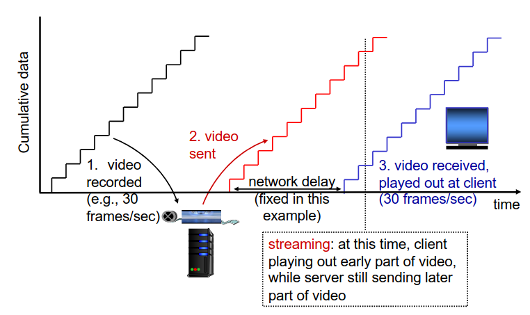
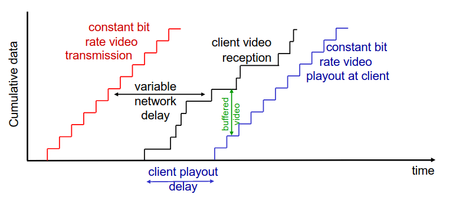
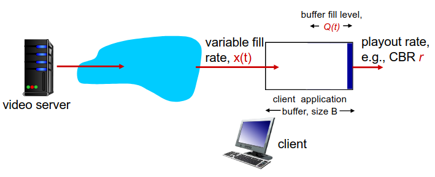

# Multimedia Networking I

## *Multimedia Networking*

### 3 tipos de aplicações de *streaming*

- *Streaming* de vídeo/áudio armazenados;
  - ***streaming***: pode começar o *playout* antes de fazer o *download* do ficheiro completo;
  - **armazenado** (num servidor): pode transmitir o áudio/vídeo mais rápido do que a sua renderização (implica que exista um *buffer* de armazenamento de dados no cliente);
  - é **essencial** que a rede tenha uma largura de banda, no mínimo, mediana;
  - **Exemplos**: YouTube, Netflix, Hulu.
- Conversações de vídeo/áudio sobre IP;
  - a natureza das conversas pessoais implicam um limite na tolerância do *delay*;
  - é muito *time sensitive*;
  - tolerante a perdas;
  - se for vídeo, necessitará de uma largura de banda;
  - **Exemplos**: Skype, Zoom, Viber, WhatsApp.
- *Streaming* de áudio ou vídeo ao vivo.
  - Tem muitos requisitos temporais;
  - **Exemplo**: Transmissão de um evento desportivo em direto.

#### *Streaming* de vídeo/áudio armazenados

- **Desafios**:
  - ***Playout* contínuo**: assim que o *playout* de um cliente inicia, o *playback* deverá dar *match* com o *timing* original.
    - O problema é que os *delays* da rede são variáveis (*jitter*)... então, precisa-se que o cliente tenha um *buffer* para dar *match* aos requisitos de *playout*.
    - No fundo, isto irá tratar-se de uma espécie de *buffer* de amortecimento que irá guardando os dados para dar *playout*.
      - Tornará a aplicação de lidar com algumas perdas;
      - Se o *buffer* se esvaziar, o vídeo irá dar *freeze*.
    - Quando o cliente iniciar o *playout*, é desejável que o vídeo mantenha um ritmo constante.
  - **Interação com o cliente**: Pausar o vídeo, dar *fast-forward*, voltar atrás, saltar partes do vídeo;
  - **Retransmissão de pacotes perdidos**.

Como se pode verificar, o *buffer* e o *playout delay* no lado do cliente permitem compensar o *delay* da rede e do *jitter*.

##### *Buffering* e *Playout* no lado do Cliente

1. Inicialmente, irá encher o *buffer* até o *playout* iniciar em $t_p$;
2. *Playout* iniciará em $t_p$;
3. O enchimento do *buffer* irá variar ao longo do tempo da mesma forma que a taxa de enchimento $x(t)$ variará e a taxa de *playout* $r$ se mantém constante.

- Quando a média da taxa de enchimento for menor que a taxa de *playout*: *buffer* irá, eventualmente, esvaziar-se (vídeo irá dar *freeze* até o *buffer* de *playout* voltar a encher);
- Quando a média da taxa de enchimento for maior que a taxa de *playout*: o *buffer* nunca se irá esvaziar e o *delay* de *plauout* inicial é suficiente para absorver a variação da taxa de enchimento.
  - ***initial playout delay tradeoff***: a *starvation* do *buffer* é menos provável, no entanto, é necessário um maior *delay* até o utilizador iniciar a visualização do conteúdo.