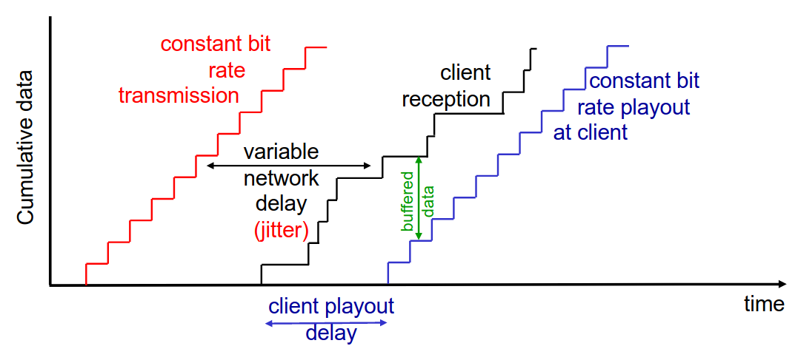
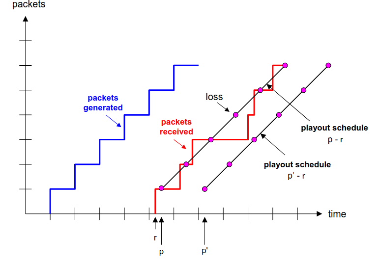
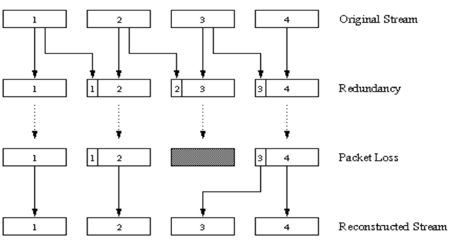
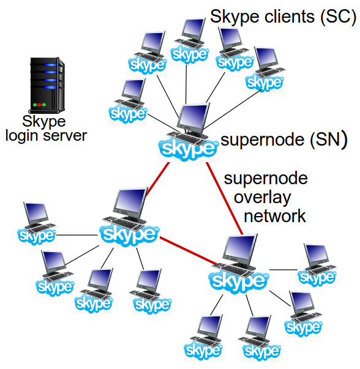
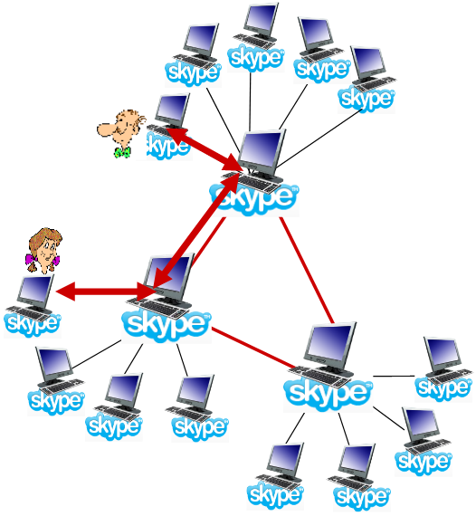
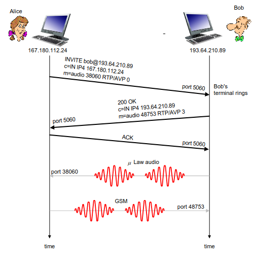
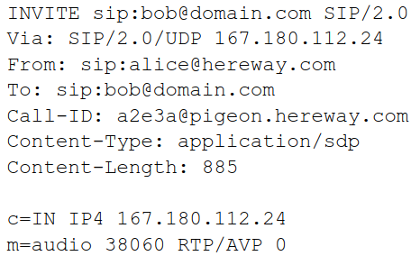
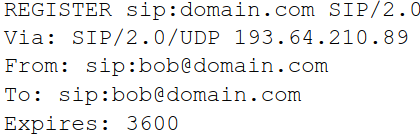
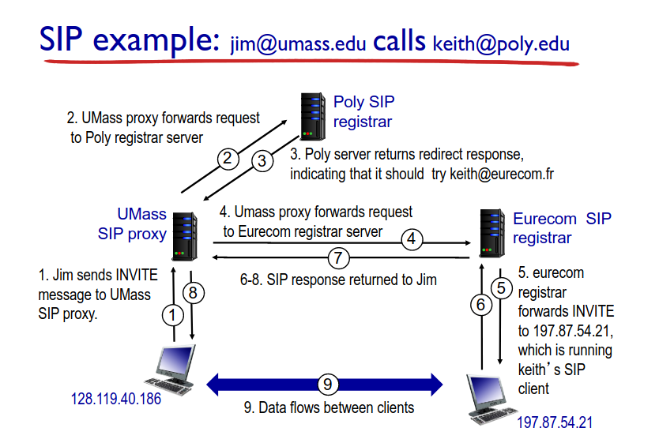

# Multimedia Networking II

## *Multimedia Networking*

### UDP

- Servidor envia a uma taxa apropriada para o cliente;
  - geralmente, a taxa de envio é igual à taxa de *encoding*, à taxa constante e à taxa de consumo;
  - a taxa de transmissão pode não querer saber de níveis de congestão.
- Tem um pequeno *playout delay* (1 a 2 segundos) para remover o *jitter* da rede;
- Recuperação de erros: ao nível da aplicação.
- **Inconvenientes**:
  - Precisa de um controlo adicional;
  - O ajuste da qualidade do vídeo, ou seja, a adaptação do débito, terá de ser feito pela aplicação em si;
  - Pode não conseguir passar *firewalls* (certas *middleboxes* podem bloquear o tráfego UDP, visto este não dar qualquer garantia)
  - É mais difícil de desenvolver para aplicações em larga escala;

### HTTP

- Corre sobre TCP;
  - Terá todos os mecanismos de controlo de congestão e fluxo do TCP.
- Obtém o conteúdo através de pedidos `HTTP GET`;
- Envia à taxa possível máxima em TCP;
- A taxa de enchimento irá flutuar devido aos mecanismos de controlo de congestão do TCP e às suas retransmissões;
- Se a taxa de consumo for menos que a taxa de receção:
  - providencia uma entrega TCP *smooth*.
- Se a taxa de consumo for maior:
  - o *buffer* será "drenado" e o vídeo irá entrar em *freeze*.

- De notar que quando o cliente remover *f bits*, irá criar espaço para novos *f bits* no *buffer* da aplicação do cliente, o que permitirá que o servidor envie *f bits* adicionais;
- A taxa de envio do servidor não poderá ser maior que a taxa de consumo no cliente. Assim, o comportamento do cliente poderá condicionar o envio de dados por parte do servidor;
- O DASH assume um comportamento semelhante ao HTTP, no entanto, é adaptativo.
- **Vantagens**:
  - Não precisa de um *media control server*;
  - Permite o vídeo *termination* e *repositioning*;
  - Não tem problemas com *firewalls*;
  - Melhor para desenvolvimento em larga escala.

### *Voice-over-IP* (VoIP)

- Particularmente sensível a variações de atrasos e menos sensível a perdas;
- O principal requisito é a necessidade de manter o aspeto conversacional;
  - Grandes *delays* são fáceis de notar;
  - *pings* menores a 150 *msec* são bons;
  - *pings* maiores que 300 *msec* são maus;
  - Inclui o nível da aplicação;
- Trabalha com base nos *talk spurt* (períodos de fala);
  - Ou seja, o tráfego é enviado a cada $20ms$,
- Adiciona um cabeçalho da camada de aplicação a cada *chunk*;
- Encapsula o *chunk* e o cabeçalho em UDP (ou segmentos TCP);
- A aplicação irá enviar segumentos para o *socket* a cada $20ms$ durante o *talk spurt*.

#### *Packet Loss* e *Delay*

- Faz *recall*, por *default*: o IP providencia um serviço de melhor esforço;
- *Network loss*: datagrama IP perdida devido à congestão da rede (*buffer* do *router* deu *overflow*);
- *Delay loss*: datagrama IP chega demasiado tarde para o *playout* do recetor:
  - *delays*: a processar, em *queue* na rede, *delays* no *end-system* (emissor, recetor);
  - *delay* máximo tolerável, tipicamente: $300ms$;
  - um *packet* atrasado é um *packet* perdido.
- Tolerância a perdas: depende do *encoding* de voz e da ocultação de perdas. Para perda de *packets* a taxa entre 1\% e 10\% pode ser tolerada.

#### *Delay Jitter*

Os *delays end-to-end* para dois *packets* consecutivos: a diferença pode ser mais ou menos que $20ms$ (diferença do tempo de transmissão).

#### *Delay* de *playout* fixo

- Quando iniciar o *playout*?
  - Recetor tenta dar *playout* de cada *chunk* exatamente $q\ ms$ após o *chunk* ser gerado;
    - o *chunk* tem *timestamp* $t$: *playout* do *chunk* em $t+q$;
    - *chunk* chega depois de $t+q$: dados que chegam tarde para o *playout* são considerados dados perdidos.
  - *Trade-off* ao escolher o valor de $q$:
    - valor alto de $q$: perdem-se menos *packets*;
    - valor baixo de $q$: melhor experiência interativa.
- O emissor irá enviar pacotes a cada $20ms$ durante o *talk spurt*.
  - O primeiro *packet* irá chegar no tempo $r$;
  - O primeiro *playout* iniciará a $p$;
  - O segundo *playout* iniciará a $p'$.

#### *Delay* de *playout* adaptativo

- **Objetivo**: ter um baixo *delay* de *playout* e baixa taxa de perda;
- **Abordagem**: ajuste adaptativo do *delay* de *playout*:
  - Estimar o delay da rede, ajustar o *delay* de *playout* no início de cada *talk spurt*;
  - Períodos silenciosos são comprimidos e alongados;
  - *Chunks* continuam a ser reproduzidos a cada $20ms$ durante o *talk spurt*.
- Adaptativamente, estima o *delay* do *packet*: (EWMA: *exponentially weighted moving average*, estimativa para o *recall* TCP RTT):

$$d_i = (1 - \alpha)d_{i - 1} + \alpha(r_i - t_i)$$

- Onde:
  - $d_i$: representa o *delay* estimado após o pacote $i$;
  - $\alpha$: pequena constante, por exemplo, $0.1$;
  - $r_i$: tempo recebido;
  - $t_i$: tempo enviado (*timestamp*);
  - $(r_i - t_i)$: *delay* medido para o pacote $i$.

- Também é útil para estimar a média do desvio do *delay*, $v_i$:

$$v_i = (1 - \beta)v_{i-1} + \beta|r_i - t_i - d_i|$$

- Estima $d_i$, calcula $v_i$ a cada *packet* recebido, mas apenas é utilizado no início do *talk spurt*;
- Para o primeiro *packet* no *talk spurt*, o *playout time* é_

$$playout\ time_i = t_i + d_i + Kv_i$$

- Os restantes *packets* no *talk spurt* são reproduzidos de forma periódica.
- Como é que um recetor determina se um *packet* é o primeiro num *talk spurt*?
  - se não existirem perdas, o recetor olha para as *timestamps* consecutivas;
    - se a diferença entre *timestamps* consecutivas for superior a $20ms$, indica que o *talk spurt* iniciou.
  - com possíveis perdas, o recetor deve olhar para as *timestamps* e para os números de sequência.
    - se a diferença entre *timestamps* consecutivas for superior a $20ms$ e o número de sequência não tem falhas, indica que o *talk spurt* iniciou.

#### Recuperar de uma perda de um *packet*

- **Desafio**: recuperar da perda do pacote dando um pequeno *delay* tolerável entre a transmissão original e o *playout*.
  - Cada ACK/NAK demora cerca de um RTT;
  - Alternativa: ***Forward Error Correction (FEC)***.
    - Envia *bits* suficientes para permitir uma recuperação sem retransmissão.
- **FEC Simples**:
  - Para cada grupo de $n$ *chunks*, cria um *chunk* redundante para utilizar `OR`-exclusivos com `n` *chunks* originais;
  - Envia $n + 1$ *chunks*, aumentando a largura de banda por um fator $\frac{1}{n}$;
  - Pode reconstruir $n$ *chunks* originais se perder nmo máximo um *chunk* dos $n+1$ *chunks* com o *delay* de *playout*.
- **Outro esquema FEC**:
  - "*piggyback lower quality stream*";
  - Envia *streams* de áudio em baixa resolução como informação redundante;
  - Perdas não consecutivas: recetor pode esconder a perda;
  - Generalização: também pode dar *append* do ($n-1$)º e ($n-2$)º menor bit da taxa de *chunk*.

- ***Interleaving* para esconder a perda**:
  - *Chunks* de áudio são divididos em unidades mais pequenas;
  - *Packets* contêm pequenas unidades de diferentes *chunks*;
  - Se um *packet* é perdido, continuar-se-á a ter grande parte do *chunk* original;
  - Não tem *overhead* de redundância, mas aumenta a latência e o *delay* de *playout*.

#### *Skype*

- Tem uma protocolo de camada aplicacional proprietário que foi inferido através de *reverse engineering*;
  - Mensagens encriptadas.
- Componentes:
  - **Clientes**: *Peers* do *Skype* conectam-se diretamente uns aos outros através de chamadas VoIP;
  - **Super-Nodos (SN)**: *Peers* do *Skype* com funções especiais;
  - **Rede de *Overlay***: Entre os SNs para localizar os SCs;
  - ***Login Server***.

- **Operação do Cliente**:
  - Junta-se à rede do *Skype* ao contactar o SN (endereço IP em *cache*) utilizando TCP;
  - Efetua o *login* para o servidor centralizado de *login* do *Skype*;
  - Obtém o endereço IP para o outro interveniente através do SN e do seu overlay;
    - Ou a lista dos amigos do cliente.
  - Inicia a chamada diretamente com o outro interveniente.

##### *Peers* como *relays*

- **Problema**: tanto a Alice, como o Bob estão atrás de NATs.
  - O NAT não permite que o *outside peer* inicie uma conexão com o *insider peer*;
  - O *insider peer* pode iniciar uma conexão com o exterior!
- **Solução *Relay***: a Alice e o Bob mantêm uma conexão aberta com os seus SNs.
  - A Alice sinaliza o seu SN para se conectar ao Bob;
  - O SN da Alice conecta-se ao SN do Bob;
  - O SN do Bob conecta-se ao Bob através da conexão aberta que o Bob, anteriormente, iniciou com o seu SN.

### *Real-Time Protocol* (RTP)

- Especifica a estrutura de *packets* com dados de áudio ou vídeo;
- RFC 3550;
- *Packet* RTP providenciam:
  - identificação do tipo de *payload*;
  - numeração da sequência do *packet*;
  - *Time stamping*.
- Corre em *end systems*;
- Os *packets* são encapsulados em segmentos UDP;
- Interoperabilidade: se duas aplicação VoIP correm RTP, então elas devem poder trabalhar em conjunto.

#### Corre em cima de UDP

As bibliotecas de RTP providenciam uma interface para a camada de transporte que extende o UDP:
- Número de portas e endereços IP;
- Identificação do tipo de *payload*;
- Numeração da sequência do pacote;
- *Time stamping*.

#### RTP e QoS

- O RTP não providencia qualquer mecanismo para garantir a entrega atempada dos dados ou qualquer outra garantia QoS;
- O encapsulamento RTP só é visto nos *end systems* (não nos *routers* intermédios).
  - *Routers* providenciam um serviço de melhor esforço, não fazendo um esforço especial para garantir que os *packets* RTP chegam ao destino de forma atempada.

#### Cabeçalho

- **Tipo de *payload*** (7 *bits*): indica o tipo de *encoding* a ser utilizado no momento. Se o emissor alterar o *encoding* durante a chamada, o *emissor* irá informar dessa troca através deste campo.
  - *Payload type 0*: PCM mu-law, $64Kbps$;
  - *Payload type 3*: GSM, $13Kbps$;
  - *Payload type 7*: LPC, $2.4Kbps$;
  - *Payload type 26*: Motion JPEG;
  - *Payload type 31*: H.261;
  - *Payload type 33*: MPEG2 video.
- **Número de Sequência** (16 *bits*): incrementa em 1 a cada *packet*RTP enviado;
  - Deteta a perda a de pacotes, restaura a sequência de pacotes.
- ***Timestamp*** (32 *bits*): instante do primeiro *byte* neste *packet* de dados RTP;
  - Para o áudio, o *timestamp clock* incrmenta em um por cada período de amostragem;
  - Se a aplicação gerar *chunks* de 160 amostras *encoded*, o *timestamp* será incrementado em 160 por cada RTP *packet* quando a fonte está ativa. O *timestamp clock* continua a crescer a um ritmo constante quando a fonte está inativa.
- **SSRC** (32 *bits*): identifica a fonte da *stream* RTP. Cada *stream* na sessão RTP tem um SSRC distinto.

#### Programação com RTSP/RTP 

- Constrói um servidor que encapsula *frames* de vídeo armazenadas em *packets* RTP;
  - Pega no *frame* do vídeo, adiciona cabeçalhos RTP, cria segmentos UDP, envia segmentos para o *socket* UDP;
  - Inclui números de sequência e *timestamps*;
  - É providenciado um cliente RTP.
- Escreve o lado do cliente no do RTSP.
  - Comandos de *play*/*pause*;
  - É providenciado um servidor RTSP.

### *Real-Time Control Protocol* (RTCP)

- Trabalha em conjunto com o RTP;
- Cada participante numa sessão RTP, de forma periódica, envia *packets* de controlo para todos os outros participantes;
- Cada *packet* RTCP contém o emissor e/ou os *reports* do recetor;
  - As estatísticas dos *reports* são úteis para as aplicações:
    - Número de *packets* enviados;
    - Número de *packets* perdidos;
    - *Interarrival jitter*.
- *Feedback* utilizado para controlar o desempenho.
  - Emissor pode modificar as suas transmissões baseando-se no *feedback*.

#### Múltiplos emissores *multicast*

- Cada sessão RTP: tipicamente um endereço *multicast* singular e todos os *packets* RTP/RTCP pertencentes à sessão usam o endereço *multicast*;
- *Packets* RTP e RTCP distinguidos dos restantes via números de portas distintas;
- De forma a limitar o tráfego, cada participante reduz o tráfego RTCP consoante o número de participantes aumenta.

#### Tipos de *Packets*

- *Receiver Report Packets*:
  - Fração de pacotes perdidos, último número de sequência, média do *interarrival jitter*.
- *Sender Report Packets*:
  - SSRC da *stream* RTP, tempo atual, número de pacotes enviados, número de *bytes* enviados.
- *Source Description Packets*:
  - Endereço de email do emissor, nome do emissor, SSRC da *stream* RTP a que está associado;
  - Providencia o *mapping* entre o SSRC e o nome do *user*/*host*.

#### Sincronização da *Stream*

- RTCP pode sincronizar diferentes *streams* de mídias numa sessão RTP;
- *Timestamps* em *packets* RTP estão presos ao vídeo, relógios de amostragem de áudi;
  - Não está preso ao tempo do relógio real.
- Cada *sender-report* do RTCP contém (para os *packets* mais recentemente gerados numa *stream* RTP associada):
  - *Timestamp* para o *packet* RTP;
  - Tempo real para quando o *packet* foi criado.
- Recetores utilizam a associação para sincronizar o *playout* do áudio ou do vídeo.

#### Escalar a largura de banda

O RTCP tenta limitar o seu tráfego a 5\% da largura de banda da sessão.

### SIP: *Session Initiation Protocol* (RFC 3261)

- Visão a longo-termo:
  - Todas as chamadas telefónicas, vídeo-conferências são feitas na Internet;
  - Pessoas são identificadas pelos nomes ou pelos endereços de email, ao invés de números de telemóvel;
  - Pode chegar ao "chamado" (se ele assim o desejar), não interessando onde este está ou o tipo de dispositivo IP que está a usar.

#### Serviços

- Providencia mecanismos para o *call setup*:
  - Para quem faz a chamada informar o recetor que pretende estabelecer a chamada;
  - Para ambos concordarem qual o tipo mídia e o *encoding*;
  - Para terminar uma chamada.
- Determina o endereço IP do recetor da chamda:
  - Mapeia identificadores de mnemónica para o endereço IP atual.
- Gestão de chamadas:
  - Adiciona novas *streams* de mídia durante a chamada;
  - Altera o *encoding* durante as chamadas;
  - Convida outros;
  - Transfere e coloca *calls* em espera.

#### Iniciar uma chamada para um endereço IP conhecido

- Mensagem SIP de convite da Alice indica o número da sua porta, ou seu endereço IP e o *encoding* em que ela prefere receber dados;
- Mensagem `200OK` do Bob indica o número da sua porta, o seu endereço IP e o seu *enoding* preferido;
- Mensagens SIP podem ser enviadas por TCP ou UDP;
  - Neste exemplo, são enviadas por RTP/UDP.
- A porta *default* do SIP é 5060.
- Negociação do *codec*:
  - Se o Bob não tiver um *encoder* para o pretendido pela Alice;
  - Enviará a mensagem `606 Not Acceptable Reply, listing his encoders`. A Alice poderá enviar uma nova mensagem de *Invite* anunciando um diferente *encoder*.
- Rejeitar uma chamada:
  - O Bob pode rejeitar a chamada com respostas de *busy*, *gone*, *payment required* ou *forbidden*.
- A mídia pode ser enviada através de RTP ou de outro protocolo.

#### Exemplo de Mensagem

- Aqui, não se sabe o endereço IP do Bob;
  - Serão necessários servidores intermédios de SIP.
- A Alice envia e recebe mensagens SIP utilizando a porta *default* do SIP, 5060;
- Especifica no cabeçalho o que envia e recebe mensagens SIP através de UDP.

#### Translação de nomes, localização do utilizador

- Queremos fazer uma chamada, mas só temos o nome ou o email do recetor;
- É preciso obter o endereço IP do *host* atual do recetor:
  - Utilizador movimenta-se;
  - Protocolo DHCP;
  - Utilizador tem dispositivos IP diferentes.
- Resultado pode ser baseado em:
  - Altura do dia;
  - Quem efetua a chamada;
  - Estado do recetor da chamada (chamada enviada para o *voicemail* quando já se está a falar com alguém).

#### *Registrar*

- Função de registo no servidor SIP;
- Quando o Bob inicia o cliente SIP, o cliente envia uma mensagem `SIP REGISTER` para o *registrar server* do Bob;
- Mensagem de registo:

#### *Proxy*

- Outra função do servidor SIP: *proxy*;
- A Alice envia mensagem de convite para o seu servidor *proxy*;
  - Contém o endereço `sip:bob@domain.com`;
  - *Proxy* responsável por fazer o *routing* das mensagens SIP para o recetor, possivelmente através de múltiplos servidores *proxy*;
- O Bob irá responder de volta por todo o conjunto de *proxies* SIP;
- O *proxy* retornará a mensagem de resposta à Alice;
  - Contém o endereço IP do Bob.
- *Proxy* do SIP é análogo a um servidor de DNS local mais um *setup* de TCP.

#### Comparação com H.323

- H.323:
  - outro protocolo de *signaling* para mídias interativos de tempo real;
  - leque de protocolos completos e integralmente verificados para conferência multimédia: sinalização, registo, controlo de admissão, transporte e *codecs*;
  - vem do ITU (telefonia).
- SIP:
  - componente singular que trabalha com o RTP, mas não é obrigado a tal. Pode ser combinado com outros protocolos ou serviços:
  - Vem do IEFT: tem muitos conceitos emprestado do HTTP;
  - Usa o princípio KISS: *Keep It Simple Stupid*.