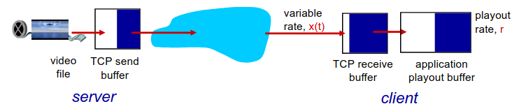

# Teórica 07

## *Multimedia Networking*

### UDP

- Servidor envia a uma taxa apropriada para o cliente;
  - geralmente, a taxa de envio é igual à taxa de *encoding*, à taxa constante e à taxa de consumo;
  - a taxa de transmissão pode não querer saber de níveis de congestão.
- Tem um pequeno *playout delay* (1 a 2 segundos) para remover o *jitter* da rede;
- Recuperação de erros: ao nível da aplicação.
- **Inconvenientes**:
  - Precisa de um controlo adicional;
  - O ajuste da qualidade do vídeo, ou seja, a adaptação do débito, terá de ser feito pela aplicação em si;
  - Pode não conseguir passar *firewalls* (certas *middleboxes* podem bloquear o tráfego UDP, visto este não dar qualquer garantia)
  - É mais difícil de desenvolver para aplicações em larga escala;

### HTTP

- Corre sobre TCP;
  - Terá todos os mecanismos de controlo de congestão e fluxo do TCP.
- Obtém o conteúdo através de pedidos `HTTP GET`;
- Envia à taxa possível máxima em TCP;
- A taxa de enchimento irá flutuar devido aos mecanismos de controlo de congestão do TCP e às suas retransmissões;
- Se a taxa de consumo for menos que a taxa de receção:
  - providencia uma entrega TCP *smooth*.
- Se a taxa de consumo for maior:
  - o *buffer* será "drenado" e o vídeo irá entrar em *freeze*.

- De notar que quando o cliente remover *f bits*, irá criar espaço para novos *f bits* no *buffer* da aplicação do cliente, o que permitirá que o servidor envie *f bits* adicionais;
- A taxa de envio do servidor não poderá ser maior que a taxa de consumo no cliente. Assim, o comportamento do cliente poderá condicionar o envio de dados por parte do servidor;
- O DASH assume um comportamento semelhante ao HTTP, no entanto, é adaptativo.
- **Vantagens**:
  - Não precisa de um *media control server*;
  - Permite o vídeo *termination* e *repositioning*;
  - Não tem problemas com *firewalls*;
  - Melhor para desenvolvimento em larga escala.

### *Voice-over-IP* (VoIP)

- Particularmente sensível a variações de atrasos e menos sensível a perdas;
- O principal requisito é a necessidade de manter o aspeto conversacional;
  - Grandes *delays* são fáceis de notar;
  - *pings* menores a 150 *msec* são bons;
  - *pings* maiores que 300 *msec* são maus;
  - Inclui o nível da aplicação;
- Trabalha com base nos *talkspurt* (períodos de fala);
  - Ou seja, o tráfego é enviado a cada $20ms$,
- Adiciona um cabeçalho da camada de aplicação a cada *chunk*;
- Encapsula o *chunk* e o cabeçalho em UDP (ou segmentos TCP);
- A aplicação irá enviar segumentos para o *socket* a cada $20ms$ durante o *talkspurt*.