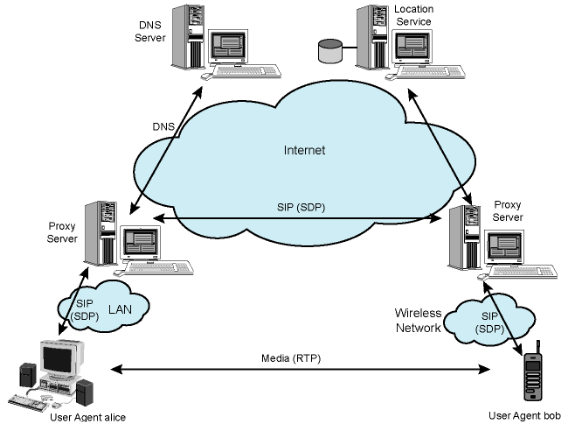
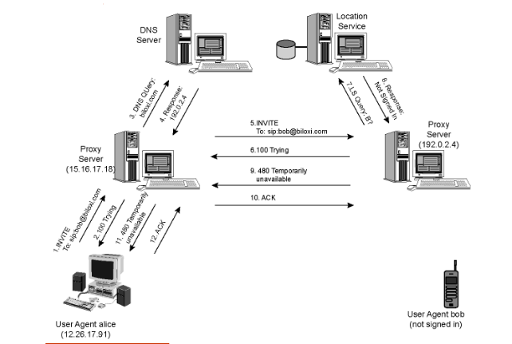
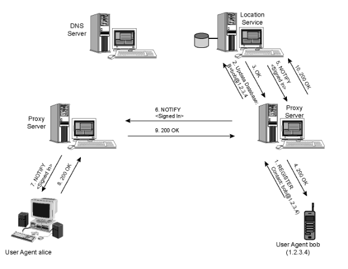
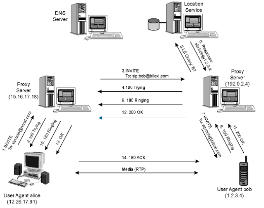

# *Signaling Protocols* (SIP - *Session Initiation Protocol*)

## NOTA:

Para ser mais fácil designar ambas as partes, definir-se-á o seguinte padrão nas próximas linhas deste documento.

- Chamador: pessoa que pretende efetutar uma chamada;
- Chamado: pessoa que irá receber a chamada.

## Motivação

- É necessário:
  - Criar e gerir sessões entre aplicações;
  - Gerar o comportamento e práticas de utilizadores heterogéneos (mobilidade, diferentes dispositivos e IDs/nomes).
- Visão a longo-prazo do SIP:
  - Todas as chamadas telefónicas e conferências por vídeo vão ser na *Internet*;
  - As pessoas serão identificadas pelos seus nomes ou *emails*, ao invés de número de telemóvel;
  - Podemos alcançar a pessoa a quem queremos ligar, independentemente da sua localização ou dispositivo IP que esteja a usar.

## *Session Initiation Protocol*

- Um protocolo de controlo da camada aplicacional (de sinalização) para criar, modificar e terminar sessões com um ou mais participantes;
- Trabalha com protocolos de multimédia em tempo real, permitindo que os diversos *endpoints* (chamados *user agents*) se conectem uns aos outros e cheguem a acordo na caracterização da sessão que pretendem partilhar;
- Para localizar possíveis participantes na sessão e outras funções, o SIP permite a criação de uma infraestrutura de *hosts* na rede (chamados *proxy servers*) para os quais os *user agents* podem enviar registos, convites para sessões e outros pedidos;
- **Funcionalidades**:
  - **Localização do Utilizador**: encontrar a localização atual de um utilizador. Os utilizadores podem aceder às funcionalidades da aplicação de forma remota;
  - **Disponibilidade dos Utilizadores**: determina a disponibilidade de um utilizador para comunicar;
  - **Capacidade dos Utilizadores**: determina os mídia e os parâmetros a serem utilizados para comunicar;
  - **Configuração de Sessão**: estabelece os parâmetros para uma sessão ponto-a-ponto e *multiparty calls*;
  - **Gestão de Sessão**: transferência e término de sessões, alteração dos seus parâmetros e chamada de serviços.
- Para a configuração de uma chamada, o SIP providencia mecanismos:
  - Para o chamador informar o recetor que alguém pretende estabelecer uma chamada com ele;
  - Para que o chamador e o chamado concordem no tipo de mídia e no *encoding*;
  - Para terminar uma chamada.
- Determinar o endereço de IP atual do chamado:
  - Mapeia o identificador da mnemónica para o endereço IP atual.
- Gestão de chamadas:
  - Adiciona novas *streams* de mídia durante a chamada;
  - Altera o *encoding* durante a chamada;
  - Convida outros utilizadores;
  - Transfere ou coloca chamadas em espera.
- O SIP *Uniform Resource Identifier* (URI) é semelhante a um endereço de *email*:
  - `sip|sips:user:password@host:port;uri-parameters?headers`;
  - `sip: bob@domain.com`.
- Baseado no modelo de transação pedido/resposta do HTTP;
- Utiliza maior parte dos cabeçalhos, regras de *encoding* e códigos de estado do HTTP;
  - Formato legível para mostrar informação;
- Utiliza o conceito de pesquisas DNS recursivas e iterativas;
- Incorpora o SDP (*Session Description Protocol*).
  - Define os conteúdos da sessão utilizando tipos semelhantes ao MIME (extensões *email*).
- Providencia primitas de serviços, não serviços;
- É um componente independente que pode ser utilizado com outros protocolos IETF (RTP, RTSP, SDP, etc...) para completar uma arquitetura multimédia;
  - Pode correr em TCP, UDP, DCCP, SCTP, RTP/RTCP, etc...
- Compreender 4 tipos de entidades lógicas: *user agent*, *redirect server*, *proxy server* e *registrar*.

### Componentes e Protocolos

- **Cliente**:
  - Envia pedidos e recebe respostas;
  - Clientes *user agent* e *proxies* são clientes.
- **Servidor**:
  - Recebe pedidos e envia respostas;
  - *Proxies*, servidores *user agent*, servidores de redirecionamento e *registrars*;
- ***User Agent***:
  - Em todas as estações terminais do SIP.
    - *User Agent Client* (UAC): Levanta pedidos;
    - *User Agent Server* (UAS): Recebe pedidos e responde.
- ***Redirect Server***:
  - Redireciona o cliente para contactar um conjunto alternativo de URIs;
  - Semelhante a pesquisas iterativas no DNS.
- ***Proxy Server***:
  - Servidor e Cliente;
  - Faz pedidos a outros clientes.
    - Faz o *routing* e força a aplicação de políticas nas chamadas;
    - Semelhante a pesquisas recursivas no DNS.
- ***Registrar***:
  - Servidor que aceita pedidos `REGISTER`;
  - Coloca a informação que recebe em pedidos na localização do serviço para o domínio.
    - Endereço SIP, endereço IP do dispositivo associado, estado...
- **Localização do Serviço**:
  - Utilizado pelo redirecionamento ou pelos *proxy servers* para obter informações acerca da possíveis localizações do chamada;
  - Mantém uma base de dados do mapeamento dos `SIP-address` $\rightarrow$ `IP-address`.

### Mensagens

#### *Requests*

- Vejam-se os seguintes exemplos de métodos:
  - ***REGISTER***: notifica a rede SIP dos endereços IP e URIs dos quais gostaria de receber chamadas;
  - ***INVITE***: estabelece a sessão entre os *user agents*;
  - ***ACK***: confirma a troca fiável de mensagens;
  - ***CANCEL***: termina o pedido em curso, mas não desfaz a chamada completa;
  - ***BYE***: termina a sessão entre utilizadores numa conferência;
  - ***OPTIONS***: solicita informações acerca das capacidades do chamado;
  - etc...

#### *Response*

- ***PROVISIONAL*** (1xx): Pedido pedido e a ser processado;
- ***SUCCESS*** (2xx): Ação recebida, compreendida e aceite;
- ***REDIRECTION*** (3xx): Preciso ação futura;
- ***CLIENT ERROR*** (4xx): O pedido contém má *syntax* ou não pode ser completado por este servidor;
- ***SERVER ERROR*** (5xx): Servidor não conseguiu processar um pedido aparentemente correto;
- ***GLOBAL FAILURE*** (6xx): Pedido não foi completado em nenhum servidor.

### Tentatia de Início de Chamada

### Notificação

### Início Bem Sucedido

