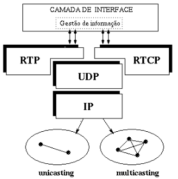
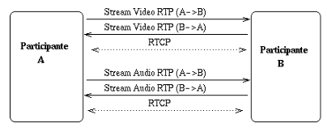

# Protocolos de Transporte RTP/RTCP

## Motivação RTP

- O TCP não está bem desenhado para aplicações interativas e com requisitos de tempo real;
  - Comunicação ponto-a-ponto não é aplicável para *multicast*;
  - Não há forma de associar o *timing* com segmentos;
  - Causa *delays* arbitrários.
- O SCTP é *multistream* mas tem algumas desvantagens do TCP;
- Não inclui informações de *timing* sem qualquer tipo de suporte para aplicações com requisitos de tempo real. O DCCP providencia algum suporte para o controlo de *buffers*, mas não para o *timing* de mídias;
- O RTP tenta fornecer suporte ao transporte de dados, áudio ou vídeo em tempo real.

### RTP

- **Objetivo**: Providencia mecanismos para entregas de dados (áudio, vídeo) em tempo real fim-a-fim.
- Aplicações típicas: vídeo-conferências, telefonia IP, etc...
- Suporta sessões *unicast* e *multicast*;
- Usa canais de dados (RTP) e um controlo de canal (RTCP);
- RTCP (*Real Time Control Protocol*) reporta o estado do canal de dados;

- **Sessão RTP**: $canal\ de\ dados + canal\ de\ controlo$;
- **Endereço de Sessão**: endereço de rede (*unicast*, *multicast*), par de portas;
- **Canal RTCP**: $Porta\ RTP + 1$;
- Na presença de múltiplas *streams* mídia, cada uma transmitida numa sessão separada ou misturadas numa sessão singular em cada direção, dependendo nos *codecs*.

- Problemas RTP:
  - Não faz reservas, não apresenta garantias de QoS;
  - Não garante a entrega de *packets*.
  - Não providencia nenhum mecanismo que garanta a entrega atempada de *packets*;
    - Os *routers* devem providenciar serviços de entrega diferentes, mas não há garantias que os *packets* RTP cheguem ao destino de forma atempada.
  - O encapsulamento RTP só é visto em *end-systems* e não por *routers* intermédios;
  - Permite a reconstrução temporal, a deteção de perdas e identificação de conteúdos.

A parte do RTCP está toda abordada em **Multimedia Networking II**.
